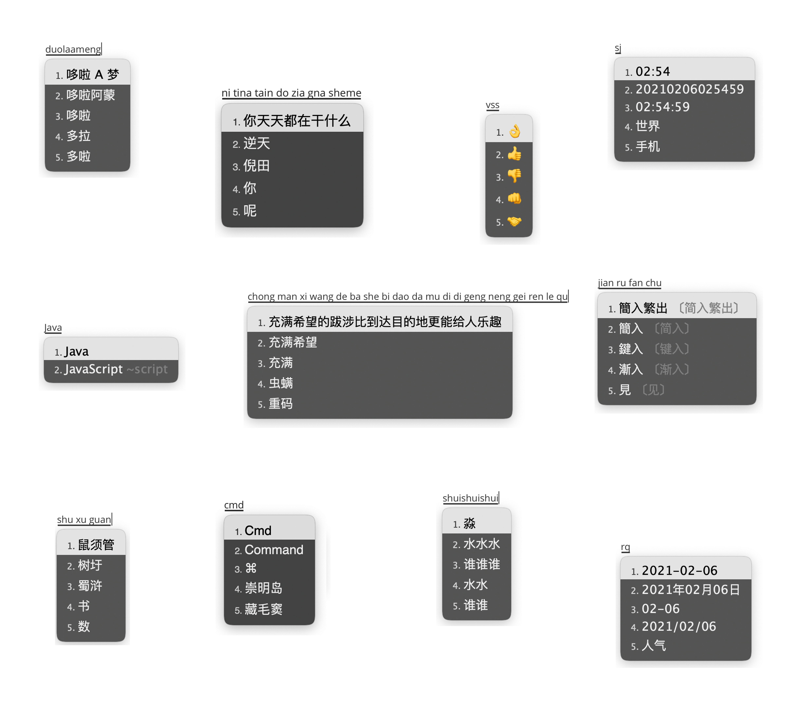

# 自用 Rime 配置




## 基本套路：

-   Squirrel 0.15.2 简中全拼
-   0.15.0 后  `charset_filter@gb2312` 失效了，放弃了「朙月拼音·简化字」方案，改用「袖珍简化字方案」 [rime](https://github.com/rime)/**[rime-pinyin-simp](https://github.com/rime/rime-pinyin-simp)**  这样在 `*.userdb.txt` 中的也是简体词库了
-   精简了字表
-   华宇拼音（紫光拼音）的系统词库 http://unispim.com/wordlib/wordlib_detail.php?id=8
-   英文输入方案 Easy English Nano（支持大写字母） [mityliu](https://github.com/mityliu)/**[rime-custom](https://github.com/mityliu/rime-custom)**
-   繁体及对应简体提示 [rime/home/issues#388](https://github.com/rime/home/issues/388#issuecomment-504572224) 
-   动态日期、时间、星期 [KyleBing](https://github.com/KyleBing)/**[rime-wubi86-jidian](https://github.com/KyleBing/rime-wubi86-jidian)**
-   所有标点符号直接上屏，「/」模式改为「v」模式，「/」直接上屏
-   没有 emoji，只在 `symbols` 里保留了不到 10 个常用的，如需要可参考 [maomiui](https://github.com/maomiui)/**[rime](https://github.com/maomiui/rime)** 、[fkxxyz](https://github.com/fkxxyz)/**[rime-cloverpinyin](https://github.com/fkxxyz/rime-cloverpinyin)** 等
-   增加了许多全拼纠错（手速太快经常按错😅）
-   参考谷歌、《现代汉语规范词典》、[异形词整理表](https://wucuozi.com/cuobiezi/yixingzi/)、[错别字辨析](https://wucuozi.com/bian/ ) 修正了大量的异形词、错别字

<br>

## 精简字表

原版字表 17K+ 的字，而《通用规范汉字表》才只收录了 8K 多个字。

如果不是需要大字库的相关文字工作者，推荐使用精简后的字表。

3500 字表推荐配合维基词库等巨型词库，不喜欢大词库的可以使用 8105 字的。

字表通过 [shengdoushi](https://github.com/shengdoushi)/**[common-standard-chinese-characters-table](https://github.com/shengdoushi/common-standard-chinese-characters-table)** 在「袖珍简化字方案」原字表中过滤形成，保留了原方案的词频，并注释掉了将近 200 个错误、废弃或不常用的多音字，如发现某多音字无法打出，请解开注释。

-   `pinyin_simp_3500` 《通用规范汉字表》的第一级 3500 常用字
-   `pinyin_simp_gb2312` GB2312 6763个字
-   `pinyin_simp_8105` 《通用规范汉字表》 8105 字（推荐）
-   `pinyin_simp.dict` 原版袖珍简化字词库，大约一万七千个字左右

<br>

## 其他

在  `custom_phrase.txt` 中可以设置某些字词永远只出现在前 N 个候选项，但是这样设置之后，这些字词就不能与正常的字共同造词。现在不知道如何能完美的固定某些字词的候选项顺序。  

<br>

顺便推荐一下在 VSCode 中给 YAML 设置默认 Tab 行为的方法：（https://github.com/microsoft/vscode/issues/69011）

使 Tab 变成 2 个空格长度的 Tab（而不是空格），修改词库时很方便，不用总是手动调节了。

`.../.vscode/settings.json`：

```json
    // Configure editor settings to be overridden for [yaml] language.
	"[yaml]": {
		"editor.insertSpaces": false,
		"editor.tabSize": 2,
		"editor.autoIndent": false,
	},
```

